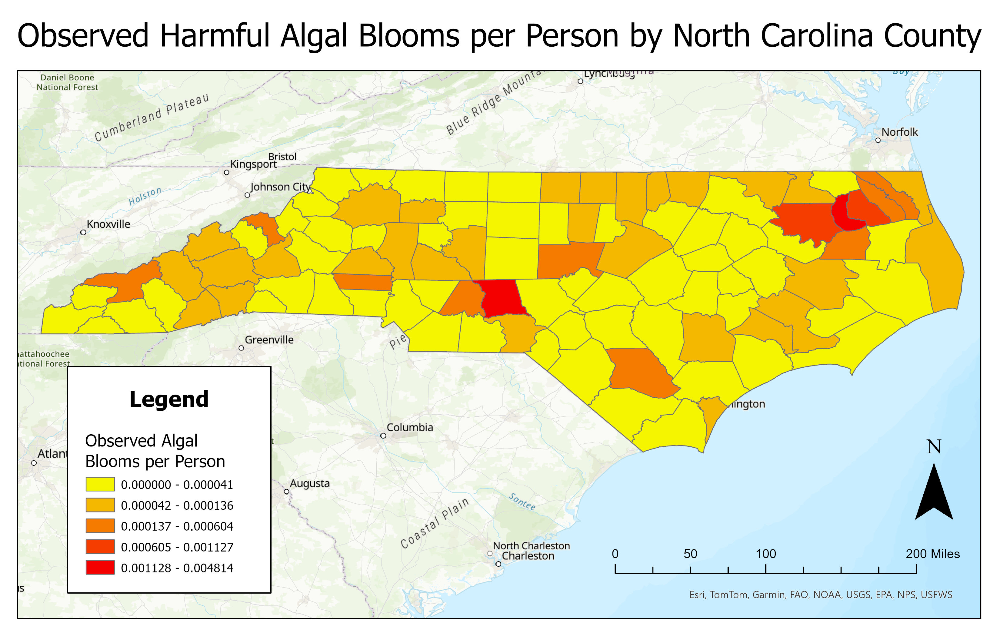

# DATA 543 FinalProject
### Group Members: Sean Gibson, Jeanelle McLeod, Andrew Stepanian
### Topic: The risk posed by harmful algal blooms (HABs) to commerical fisheries in the Pamlico and Albemarle Sounds

## BACKGROUND
Harmful algal blooms, which are becoming increasingly common in coastal and estuarine environments, are mainly driven by nutrient pollution, rising temperatures, and changing hydrological conditions. As the climate warms, higher water temperatures create ideal conditions for algae to thrive. These blooms can produce toxins and deplete oxygen levels, leading to fish kills, ecosystem disruption, and economic impacts. North Carolina is known for its agricultural activity, as it experiences significant nutrient runoff from farms, which is a leading cause of HABs. It is home to a wide range of water sources ranging from large freshwater lakes in the central regions to estuaries along the coast – many of which are exposed to anthropogenic nutrient pollution from farmlands close to the waters. HABs are one of the most relevant environmental threats impacting North Carolina's coastal communities and the fisheries that support them. On top of economic pressures facing communtiies like tariffs, HABs can influence seafood prices by disrupting harvests. Consequently, when landings decrease due to algae bloom impacts, a lack of supply can cause an increase in market prices. 

Our primary research objective is to build a classification model that can predict whether an algal bloom will occur based on relevant environmental variables. Then, depending on data availability, we would like to connect our model to commercial fisheries landings data to analyze how algal bloom occurrences financially impact commercial fisheries. By modeling algal blooms as our hazard, we hope to better understand the environmental conditions that cause algal blooms and provide local agencies and fisheries with a tool to best forecast and ultimately prepare for the occurence of a bloom.

In this context, the hazard is the harmful algal bloom (HAB) itself, as HABs are associated with depleted oxygen levels and toxins in the water which disrupt ecosystems. The exposure, or the potential for negative outcomes from a HAB, include prolonged fish kills, reduced fish harvests, and a decline in coastal tourism and recreation. Finally, the vulnerability refers to the the financial losses for fisheries and coastal businesses resulting from the fish kills and associated reduced tourism and recreation caused by HABs.

## DEFINITION OF STUDY AREA
We wanted to identify areas in North Carolina that are most at risk for algal blooms to narrow the scope of our project, so we first created a heatmap of citizen reported algal bloom events from the Fish Kill & Algal Bloom Report Dashboard. This spatial visualization (Figure 1 below) shows clusters of high algal bloom observance reports per capita in the Albemarle–Pamlico Sound region, which confirms it as a prime location for our analysis. Since our project also aims to model the risk of HABs to commercial fisheries, the Albemarle Sound is home to a number of commercially important species including blue crab and flounder. Therefore, this area selection allows us to study a region that plays a major role in fishery productivity but is highly vulnerable to environmental hazards like algal blooms. Some areas on our heat map, such as central North Carolina, had a high frequency of HAB reports due to freshwater lakes in central North Carolina which are particularly vulnerable because they have limited circulation and warm up faster than larger coastal systems, creating ideal conditions for algae to accumulate and grow. However, this region was not of interest to us since inland freshwater lakes are not directly involved in commercial seafood production. Our chosen region is a large estuarine system surrounded by agricultural counties such as Pamlico, Chowan, Dare, Hyde, Beaufort, and Washington. These areas are home to crop and livestock farming, which contribute to nutrient runoff into the waters. Fertilizers used in crop farming release nitrogen and phosphorus, and waste from both hog and poultry farming in this region create high levels of nitrogen inputs to surrounding watersheds which are key drivers of HABs.

Figure 1: 


## DATA SOURCES
* The Water Quality Portal (WQP) stores water quality data from generators across the U.S, including algal biomass, taxonomic composition, and toxins. Specifically, we extracted data from ocean and estuary stations in North Carolina for chlorophyll-a concentrations and nutrient concentrations.
(https://www.waterqualitydata.us/)

* The DENR dashboard of historical/current fish kills and HABs in North Carolina was used as our data source for algal bloom observations. Specifically, the dataset was filtered for observances of algal blooms or both algal blooms and fish kills from 2019-2025.
(https://ncdenr.maps.arcgis.com/apps/dashboards/7543be4dc8194e6e9c215079d976e716)

* The NOAA Fisheries Landings data portal was used to gather commercial landings data from 2019-2023 for the top 10 most sought after species for fishermen in the Pamlico-Albemarle region (https://www.fisheries.noaa.gov/foss/f?p=215:200::::::)

* “A SOCIAL AND ECONOMIC ANALYSIS OF COMMERCIAL FISHERIES IN NORTH CAROLINA: Atlantic Ocean” provided the top 10 most sought after species for fishermen in the study region (https://www.deq.nc.gov/marine-fisheries/science-statistics/fisheries-statistics/socioeconomic-reports-and-data/social-and-economic-analysis-commercial-fisheries-north-carolina/open)

## DATA PREPARATION

The original plan for our analysis was to build a classification model that could predict whether an algal bloom will occur in the Pamlico/Albemarle Sound region based on the following environmental variables: nutrient concentrations (ammonia, ammonium, nitrate, and phosphate), chlorophyll-a concentrations, and water temperature. However, to train our model, we needed each of the environmental variable datasets to overlap with each other, as well as the algal bloom observation data. In other words, we needed temperature, chlorophyll-a, and nutrient data taken in the same general area and same time as an algal bloom observation. Upon further investigation of the data, we found that the data overlapped spatially, but not temporally, as the smallest time frame between an algal bloom observation and any environmental sample was over 1 year. Additionally, water temperature data was extremely sparse (in both space and time) compared to nutrient and chlorophyll data, which was limiting our analysis. Therefore, we decided we needed to shift gears and come up with a new approach.

Given the lack of well-distributed water temperature data in our study region, we decided to use month as a proxy for water temperature, making the assumption that summer months would have warmer water temperatures, and winter months would have cooler water temperatures. A new ‘Month’ variable was added to each dataset so that each observation or sample had an associated number representing the month it was taken or recorded. Then, each dataset – the algal bloom observations, nutrient samples, and chlorophyll-a samples – were filtered to the study area (the Pamlico and Albemarle Sound region). Using ArcGIS Pro, we divided our study area into a grid of 25 equal-sized cells and joined each of the datasets to the grid so that each algal bloom observation, nutrient sample, and chlorophyll-a sample had an associated grid cell. Then, for each grid cell, the mean chlorophyll-a and nutrient concentrations were calculated for each month. Finally, the algal bloom observation dataset was joined to these statistics so that the number of algal blooms observed in each grid cell across each month was recorded. Additionally, a ‘Bloom’ variable was created so that if an algal bloom observation had occurred during a given month in a given grid cell, this would be represented by a 1; month and grid cell combinations which did not have an algal bloom observance were assigned a 0.

The final dataset used to build the classification model consists of 6 variables: 
* Grid_ID (the unique grid identification number assigned to each grid cell of the study area region - numbered 1 through 25)
* Month (month of the year a concentration or observation was recorded - numbered 1 through 12)
* Mean_Chlorophyll_Conc (mean chlorophyll-a concentration in µg/L for a given month and grid cell combination)
* Mean_Nutrient_Conc (mean nutrient concentration in µg/L for a given month and grid cell combination)
* AlgalBloom_Observations (number of algal blooms observed within a given grid cell during a given month)
* Bloom (presence or absence of an algal bloom - 1 = algal bloom observed, 0 = no algal bloom observed)


## ANALYSIS

```
import pandas as pd

## Load the dataset
df = pd.read_csv('DATA543_ModelDataset.csv')

## Select features and target
## We're using month, mean chlorophyll-a concentrations, and mean nutrient concentrations as our predictor variables
## Our target is the bloom variable because this is what we're trying to predict

features = ['Month', 'Mean_Chlorophyll_Conc', 'Mean_Nutrient_Conc']
target = 'Bloom'

X = df[features]
y = df[target]
```

```
from sklearn.model_selection import train_test_split

## 80% training data, 20% testing data split

X_train, X_test, y_train, y_test = train_test_split(
    X, y, test_size=0.2, random_state=42, stratify=y
)
```

```
## Using xgboost package since our data is unbalanced (considerably more 0s than 1s)
!pip install xgboost
import xgboost as xgb
from sklearn.metrics import classification_report, confusion_matrix

## Create the classifier
model = xgb.XGBClassifier(use_label_encoder=False, eval_metric='logloss')

## Train the model
model.fit(X_train, y_train)

## Predict algal bloom occurrence based on predictor variables
y_pred = model.predict(X_test)

## Evaluate the performance of the model
print(classification_report(y_test, y_pred))
print(confusion_matrix(y_test, y_pred))
```
## CONCLUSIONS

## LIMITATIONS AND EXTENSIONS

As discussed previously, our main limitation in building our classification model was the lack of chlorophyll-a, nutrient, and water temperature data that overlapped spatially and temporally with algal bloom observation data. Ideally, each algal bloom observation would’ve had a nearby sampling station from which nutrient, chlorophyll-a, and temperature water samples were taken frequently enough that the algal bloom could have associated environmental variables to build a classification model from. Ultimately, we could not justify building a model off of samples that were taken more than 1 year before or after an observation was recorded. Additionally, water temperature data was taken at fewer sampling stations across the study region, and if we were to incorporate this data, often the nearest algal bloom observation to a temperature sampling location was too far away to reasonably use. Aggregating nutrient and chlorophyll-a concentrations by mean and across several years was also not ideal, as this does not account for fluctuations over the years – for example, if there has been an increase in anthropogenic nutrient inputs to the Pamlico and Albemarle Sounds in recent years, this is not captured.

In terms of quantifying the risk posed to commercial fisheries in the region, we ideally would have used landings data taken at a smaller spatial and temporal resolution (for example, landings by county per month across 2019-2025). This could have allowed us to define a stronger relationship between algal bloom occurrences with commercial fisheries landings in the Pamlico and Albemarle Sounds. Similarly, taking the year component out of the nutrient and chlorophyll data to make our model more reasonable in terms of predicting algal bloom occurrences made our analysis of financial risk for commercial fisheries in the study area much more difficult, since we could only recover commercial fisheries landings data on a yearly scale.

Finally, we were hoping to predict financial losses to commercial fisheries due to rising ocean temperatures and the associated algal blooms (since warmer temperatures are associated with algal blooms). For example, we could have increased each temperature by a certain number (ex: 0.13°C) and run the model with these increased temperatures to see how algal bloom frequency and commercial fisheries landings would be impacted. However, as discussed, there was not sufficient temperature data at the resolution we needed, meaning we had to use month (a categorical variable) as our proxy for water temperature, and our model simply considers seasonality in general and not necessarily how an increase of a few degrees would impact algal bloom frequency.

Overall, the lack of environmental data taken on a consistent spatial and temporal resolution made our analysis difficult – particularly when it came to linking our HAB prediction model to data regarding commercial fisheries landings. In the future, efforts could be dedicated to finding data linking the natural and financial systems at play in our project.

